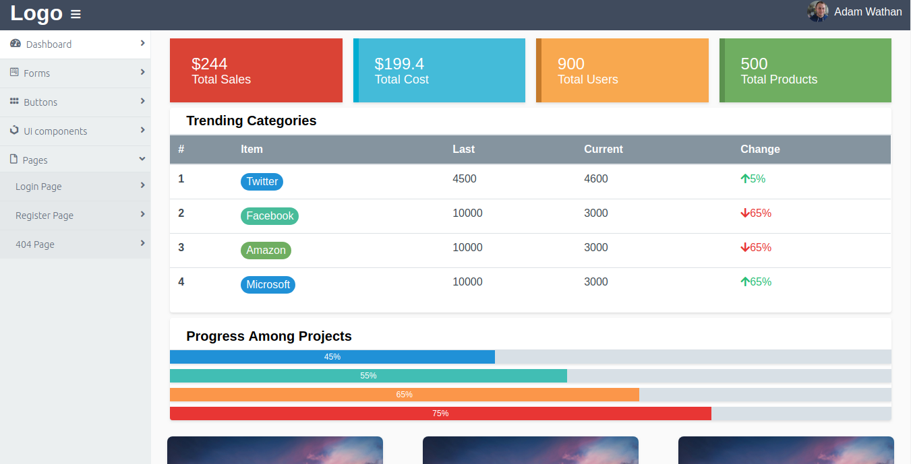
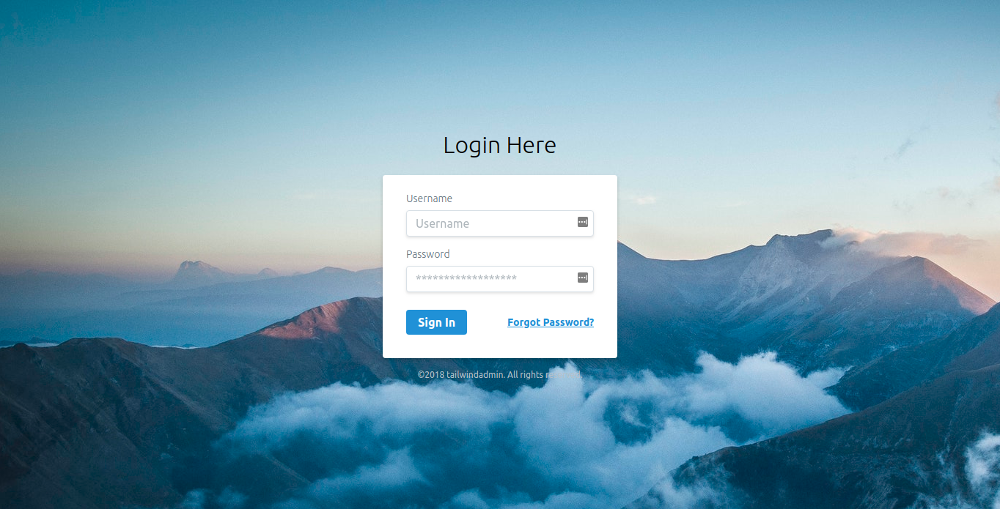

# Tailwind Admin

Super simple admin panel using [Tailwind CSS](https://tailwindcss.com).

[Live Demo](https://tailwindadmin.netlify.app)

## Note
For Tailwind CSS version < 1.0
Please use 1.0.0 branch

To get started, clone or download the project
Then Open index.html.

### Dashboard

### Login

### Please report any issue or suggestions in issue tracker, all issues or suggestions will be promptly addressed. We would love a pull request.

## TODO:
 * Animation
 * Datatables
 * Widgets

## IN PROGRESS:
 * Vue Js based admin panel template
 
